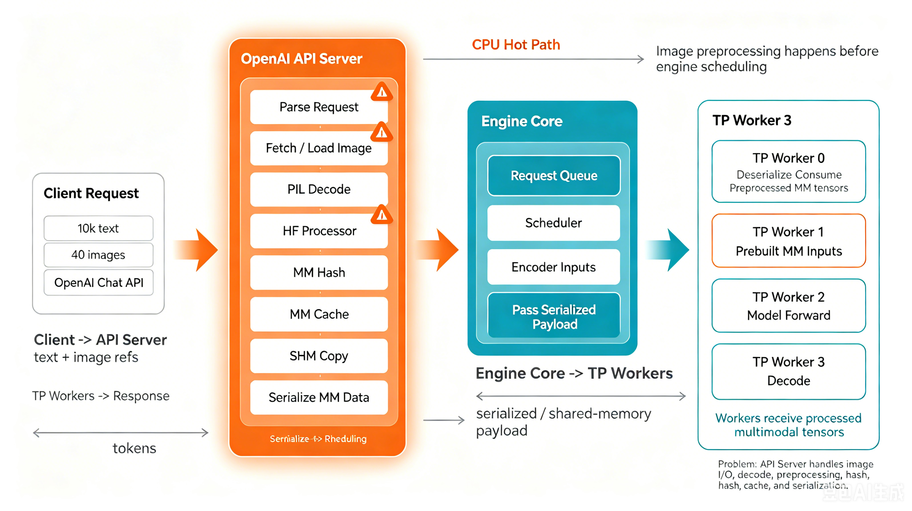
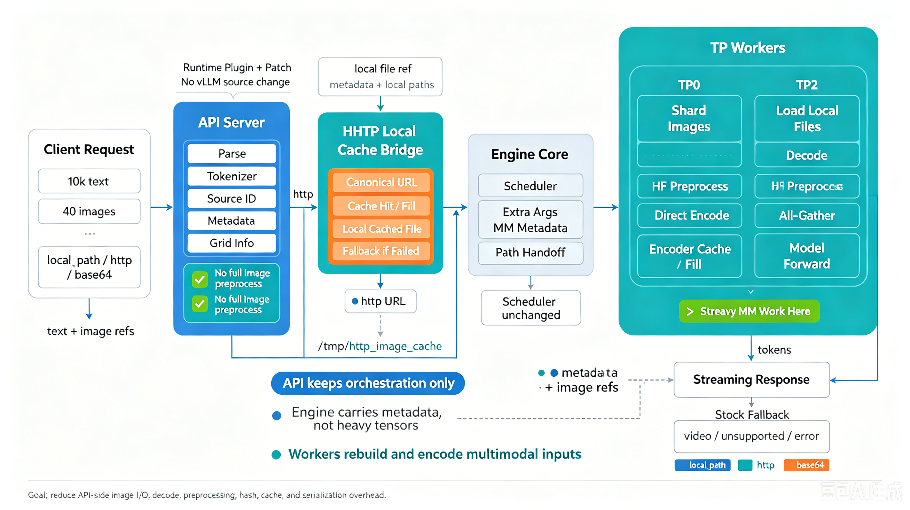
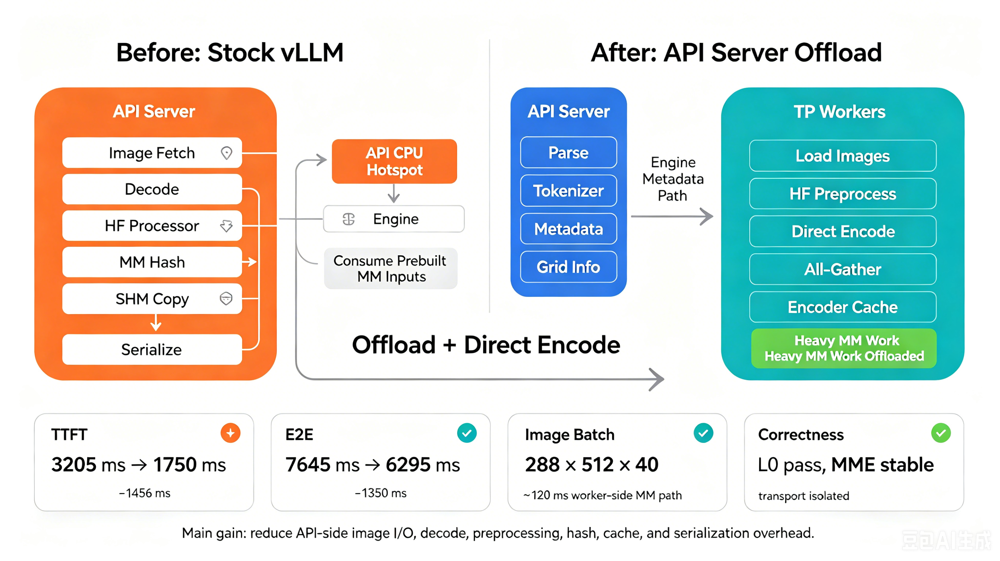

# 0428 API Server 优化交付工程

## 1. 工程背景

这个目录用于沉淀当前多模态优化工作的最新可交付版本，目标模型为
`Qwen3.5-4B`，目标场景是高多图、多模态、大上下文请求。

典型负载特征：

- 文本约 `10k` token
- 图片约 `40` 张
- 部署模式以 `TP4/TP8`、`--enforce-eager`、`mm shm cache` 为主

原始多模态链路里，API server 会承担大量 CPU 侧工作：

- 本地图片读取
- 图片解码
- HF processor 图像预处理
- multimodal hash
- 部分缓存和拷贝相关工作

这些逻辑会成为 TTFT 和端到端时延的热点，因此本工程的核心目标是：

- 在**不修改安装环境中的 `vllm` / `vllm-ascend` 源码**前提下
- 通过插件注册、运行期 patch 和启动脚本
- 逐步把原本压在 API server 上的多模态重处理逻辑下沉到 worker 侧

## 2. 方案总览

本工程已经完成 `phase0 ~ phase4` 全阶段开发。

各阶段职责如下：

- `phase0`：原始链路基线，只补统一性能打点
- `phase1`：稳定 identity / hash 基础优化
- `phase2`：下沉链路铺设与 phase plumbing
- `phase3`：`direct encode` 主方案，当前核心主线
- `phase4`：面向 `http` 输入的专项优化与缓存可靠性增强

当前主线判断：

- `phase3 direct encode` 是当前本地多模态输入的主方案
- `phase4` 是在 `phase3` 基础上补齐 `http` 输入优化和可靠性能力
- 历史上的 `phase3-local-only / local-plus` 已不再作为推荐方案

一句话概括当前方案：

`phase3 = worker 侧 direct encode 主链路`

`phase4 = http 输入先 materialize/缓存到本地，再复用 phase3 worker 链路`

## 3. 架构图速览

为了便于快速理解当前方案，建议先按下面三张图建立整体印象，再继续阅读详细设计文档。

### 3.1 原始 stock vLLM 多模态链路

原始链路中，API server 需要承担图片读取、解码、HF processor 预处理、multimodal hash、缓存与序列化等 CPU 侧重处理逻辑；随后再把处理后的多模态数据传递给 engine / worker。



### 3.2 API Server 下沉后的优化架构

优化后的主链路中，API server 尽量只保留请求解析、tokenizer、source identity、metadata 和 grid 信息；图片读取、HF preprocess、direct encode、all-gather 与 encoder cache 回填下沉到 TP worker 侧执行。HTTP 输入先通过本地缓存桥接为 local file ref，再复用 worker 侧 direct encode 链路。



### 3.3 收益来源与性能对比

当前收益主要来自减少 API server 侧 image I/O、decode、HF preprocess、hash、cache / shm copy 与序列化开销，并把重型多模态处理迁移到多个 TP worker 进程并发执行。原始链路即使在 API server 进程内使用线程池做图像处理，也容易受 Python 运行时、线程调度、图像库行为和 CPU 核利用率不充分等因素影响，无法稳定把机器上的 CPU 并行能力吃满；而模型部署本身通常已经是多 TP，每个 TP worker 都是独立进程。下沉后，40 张图像会按负载切分给多个 TP worker，由多个独立进程分别执行图片读取、decode、HF preprocess 和 direct encode，从而形成更真实、更稳定的多进程并发。典型 HTTP 口径下，TTFT 从约 `3205 ms` 降到约 `1750 ms`，E2E 从约 `7645 ms` 降到约 `6295 ms`。



## 4. 当前已经完成的能力

- `tp4` 启动与稳定运行
- `local_path` 支持
- `http` 支持
- `base64` 支持
- 视频请求保持 stock fallback
- `L0 / L0.5 / MME` 多轮精度回归
- `phase4` 坏缓存识别与自愈
- `phase4` HTTP 缓存上限控制与容量清退
- `phase4` 失败回退可观测

当前工程状态已经从“服务能否稳定跑起来”转到“多图精度与后续性能优化空间”。

## 5. 文档入口

当前只保留 `docs_0428/` 作为正式文档目录。

建议阅读顺序：

1. `docs_0428/01_整体设计与分阶段设计.md`
2. `docs_0428/02_部署文档.md`
3. `docs_0428/03_测试与性能文档.md`
4. `docs_0428/04_开发日志.md`

如果是新的 session，只看 `docs_0428/` 就应该能理解当前方案、部署方式、测试方法和阶段结论。

## 6. 目录说明

- `bundle/`
  - 启动脚本
  - vLLM 插件入口
  - phase patch
- `scripts/`
  - 服务拉起辅助、精度测试、性能测试、phase 对比、可靠性 smoke
- `data/`
  - 本地样例和测试数据
- `docs_0428/`
  - 当前唯一保留的交付文档集
- `results/`
  - 本地回归与测试产物

## 7. 核心启动方式

### 7.1 通用约定

所有 phase 启动都通过环境变量控制，不要求修改 site-packages，也不要求重打 wheel。

最常用的公共变量如下：

```bash
export MODEL_DIR=/mnt/sfs_turbo/models/Qwen/Qwen3.5-4B
export ALLOWED_LOCAL_MEDIA_PATH=/mnt/sfs_turbo/codes/lzp/0428/data
export HOST=127.0.0.1
export PORT=8000
```

如果跑 `tp4`，常用额外变量：

```bash
export TENSOR_PARALLEL_SIZE=4
export MM_PROCESSOR_CACHE_TYPE=shm
export MM_PROCESSOR_CACHE_GB=20
export MM_ENCODER_TP_MODE=data
export GPU_MEMORY_UTILIZATION=0.85
export MAX_MODEL_LEN=36864
```

### 7.2 phase0

```bash
export MODEL_DIR=/path/to/Qwen3.5-4B
export ALLOWED_LOCAL_MEDIA_PATH=/path/to/0428/data
/path/to/0428/bundle/start_phase0_server.sh
```

### 7.3 phase3 direct encode

```bash
export MODEL_DIR=/path/to/Qwen3.5-4B
export ALLOWED_LOCAL_MEDIA_PATH=/path/to/0428/data
/path/to/0428/bundle/start_phase3_server.sh
```

### 7.4 phase4 http cache bridge

推荐缓存配置：

```bash
export MODEL_DIR=/mnt/sfs_turbo/models/Qwen/Qwen3.5-4B
export ALLOWED_LOCAL_MEDIA_PATH=/path/to/0428/data
export VLLM_ASCEND_HTTP_CACHE_DIR=/tmp/vllm_ascend_http_cache
export VLLM_ASCEND_HTTP_CACHE_MAX_GB=2
export VLLM_ASCEND_HTTP_CACHE_VERIFY_ON_HIT=1
export VLLM_ASCEND_MM_FILE_MAP=/tmp/vllm_ascend_mm_file_map.jsonl
/path/to/0428/bundle/start_phase4_server.sh
```

说明：

- `VLLM_ASCEND_HTTP_CACHE_MAX_GB=2` 是当前推荐的“合理缓存配置”
- `VLLM_ASCEND_HTTP_CACHE_VERIFY_ON_HIT=1` 用于命中校验与坏缓存自愈
- `VLLM_ASCEND_MM_FILE_MAP` 用于保留 phase4 trace，便于排障和验证

## 8. 常用测试方式

### 8.1 Smoke

```bash
curl -s http://127.0.0.1:8000/v1/models
```

### 8.2 phase4 三 transport 精度矩阵

当前统一编排脚本：

- `scripts/run_phase4_precision_matrix.py`

支持的 transport：

- `local_path`
- `http`
- `base64`

支持的 suite：

- `L0`
- `L0.5`
- `MME`

示例：

```bash
python /path/to/0428/scripts/run_phase4_precision_matrix.py \
  --execute \
  --wait-ready
```

如果跑 `http` 模式，需要先准备本地静态 HTTP 根，例如：

```bash
python3 -m http.server 9000 --directory /path/to/0428/results/phase4_precision/http_root
```

### 8.3 可靠性 smoke

当前有专门脚本：

- `scripts/phase4_reliability_smoke.py`

重点验证：

- 坏缓存识别与自愈
- 缓存上限与容量清退
- phase4 失败回退可观测

## 9. 当前精度结论

在推荐缓存配置下，`phase4/tp4` 三种输入模式的精度结果如下：

| Transport | L0 | L0.5 | MME exact_acc | MME perception | MME reasoning |
|---|---:|---:|---:|---:|---:|
| `local path` | `10/10` | `23/40 = 0.5750` | `80.7498` | `1585.9953` | `567.1429` |
| `http` | `10/10` | `24/40 = 0.6000` | `80.7919` | `1582.4806` | `574.6429` |
| `base64` | `10/10` | `24/40 = 0.6000` | `80.8340` | `1586.7159` | `574.6429` |

当前结论：

- `L0` 三种 transport 全通过
- `L0.5` 上 `http / base64` 略优于 `local path`
- `MME` 上 `base64` 略优，`http` 非常接近，`local path` 略低，但整体差距不大

## 10. 当前重点任务

后续继续开发时，默认把重点放在：

1. `phase3 direct encode` 多图精度提升
2. 保持 `phase4 http` 与 `local_path / base64` 的功能正确性
3. 在不破坏当前稳定性的前提下继续优化 worker 侧热点

## 11. 接手建议

如果是新的会话或新的维护者，建议：

1. 先读 `docs_0428/01_整体设计与分阶段设计.md`
2. 再读 `docs_0428/02_部署文档.md`
3. 再读 `docs_0428/03_测试与性能文档.md`
4. 最后读 `docs_0428/04_开发日志.md`
5. 然后进入代码：
   - `bundle/start_phase_server.sh`
   - `scripts/launch_registered_server.py`
   - `bundle/vllm_phase2_plugin/register.py`
   - `bundle/vllm_phase2_plugin/patches/phase1.py`
   - `bundle/vllm_phase2_plugin/patches/phase2.py`
   - `bundle/vllm_phase2_plugin/patches/perf.py`
